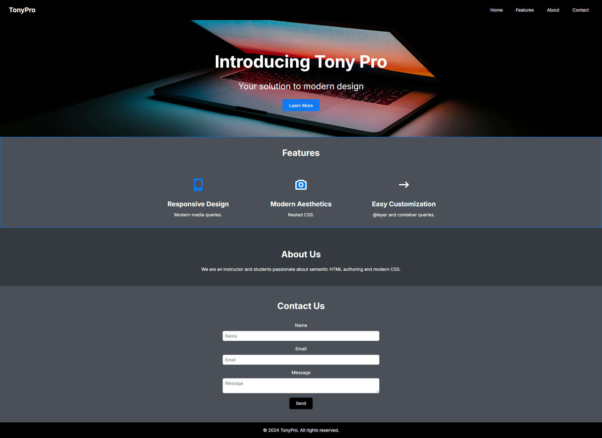

# Landing Page

## Sobre
Este projeto foi desenvolvido no curso Understanding HTML and CSS, disponibilizado na trilha do Programa de Bolsas da Compass UOL (PB_MAR25).
 Seu objetivo foi ensinar sobre como escrever HTML de forma semântica e como estilizar os elementos em CSS, utilizando CSS @layer Rule.
## Tecnologias
- HTML
- CSS
- JavaScript
## Desenvolvido por
- Desenvolvido com amor por [camilazucchi](https://www.github.com/camilazucchi).